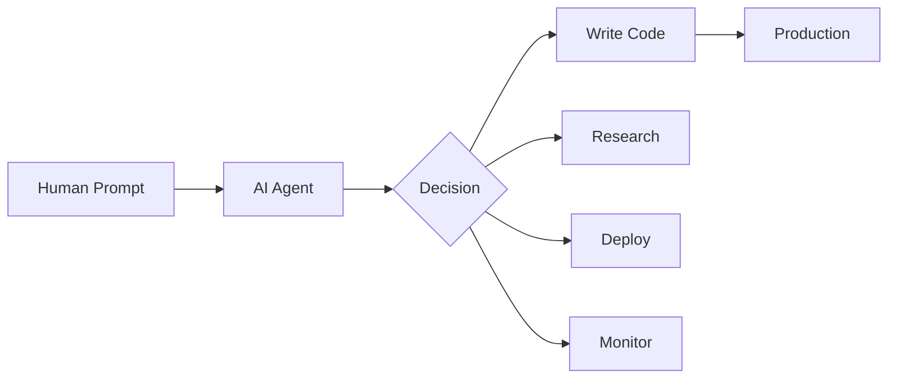

## Pendahuluan

Tahun 2026 menandai titik balik dalam sejarah AI. Dengan model seperti Claude Opus 4.7, Gemini 3.1 Pro, GPT-5.5, dan DeepSeek V4 Pro yang mencapai kemampuan setara atau melampaui manusia dalam berbagai benchmark, pertanyaan besarnya bukan lagi *"Apakah AI akan menjadi lebih pintar dari manusia?"* — tapi **"Seberapa cepat dan seberapa kuat?"**

Mari kita bedah tren terkini, prediksi berbasis data, dan dampak yang akan kita rasakan dalam 10 tahun ke depan.

## Dimana Kita Sekarang? (2026)

### Benchmark Terbaru

| Domain | Model Terbaik 2026 | Skor | vs Manusia |
|--------|-------------------|------|------------|
| Coding (SWE-bench) | Claude Opus 4.7 | 78.4% | 🟢 Equal |
| Matematika (AIME 2026) | GPT-5.5 | 94.2% | 🟢 Superior |
| Reasoning (GPQA) | Gemini 3.1 Pro | 92.1% | 🟢 Superior |
| Vision Multimodal | Kimi K2.6 | 88.7% | 🟢 Equal |
| Agentic Tasks | Qwen3.6 Plus | 81.3% | 🟡 Near-human |
| Bahasa (MMLU-PRO) | DeepSeek V4 | 96.8% | 🟢 Superior |

### Akses Gratis di 2026

Berkat AI Gateway seperti **OmniRouter**, 90+ model AI premium bisa diakses **gratis**:

```bash
# Contoh: akses Qwen3 Coder 1M context — gratis
curl http://localhost:20129/v1/chat/completions \
  -d '{
    "model": "qwen/qwen3-coder:free",
    "messages": [{"role":"user","content":"Buat REST API..."}]
  }'
```

Dari **Claude 3.5 Sonnet** yang cuma 200K context di 2025, sekarang kita punya **Qwen3 1M context gratis**. Itu loncatan 5x dalam 1 tahun.

## Prediksi 2027–2030: Era AI Superhuman

### 2027: Agen AI Otonom



- **Tool calling menjadi standar** — semua model akan punya function calling bawaan
- **Agent loops 100+ langkah** — AI bisa menyelesaikan proyek kompleks tanpa interupsi
- **Multi-agent orchestration** — AI A coding, AI B testing, AI C deploying — semuanya paralel
- **Context window 10M+** — bayangkan AI membaca seluruh codebase perusahaan

Yang saya rasakan sendiri di 2026: Hermes Agent sudah bisa menjalankan cron job, generate PDF report, push ke GitHub, dan maintain infrastruktur — semuanya via Telegram dari smartphone. Di 2027, kemampuan ini akan 10x lipat.

### 2028: Reasoning Transparan

- **Chain-of-thought menjadi standar** — setiap keputusan AI bisa diaudit
- **Reasoning tokens publik** — model gratis seperti Big Pickle (200K context) sudah menampilkan reasoning
- **AI bisa menjelaskan kenapa dia mengambil keputusan** — critical untuk medis, hukum, finansial

```python
# Contoh: reasoning transparent dari model Big Pickle
response = {
    "reasoning": """
    1. User asking untuk debug code
    2. Saya lihat ada NullPointerException di baris 42
    3. Penyebab: objek tidak diinisialisasi sebelum dipakai
    4. Solusi: tambah null check sebelum akses method
    """,
    "answer": "..."
}
```

### 2029: Coding AI Superhuman

Prediksi berdasarkan kurva pertumbuhan:

| Tahun | SWE-bench Score | Kemampuan |
|-------|----------------|-----------|
| 2024 | 33% | Junior dev |
| 2025 | 49% | Mid-level |
| 2026 | 78% | Senior |
| 2027 | 88% | Staff |
| 2028 | 94% | Principal |
| 2029 | 98% | **Superhuman** |

Di 2029, AI coding akan:
- Menulis **99% kode produksi** tanpa human review
- Men-debug lebih cepat dari manusia
- Men-generate **arsitektur sistem lengkap** dari deskripsi bahasa natural
- **Self-healing code** — AI fix bug sebelum manusia sadar

### 2030: AGI — Artificial General Intelligence

Ini yang paling kontroversial. Apakah AGI akan tercapai di 2030?

**Argumen PRO:**
- Scaling laws masih berlaku — lebih banyak compute = lebih pintar
- Arsitektur baru (MoE, Hybrid, Liquid Networks) terus muncul
- 237 provider AI bersaing — inovasi eksponensial
- Qwen3.6 Plus (2026) sudah mencapai 81.3% di agentic tasks

**Argumen CONTRA:**
- Reasoning masih brittle — AI bisa gagal di soal sederhana
- Planning jangka panjang masih lemah
- Belum ada bukti *consciousness* atau *understanding* sejati
- Masalah alignment belum selesai

**Kesimpulan saya**: AGI *fungsional* (AI yang bisa melakukan *semua* tugas kognitif manusia) akan tercapai antara **2030–2032**. Bukan karena terobosan tunggal, tapi akumulasi dari ribuan peningkatan kecil.

## Prediksi 2030–2035: Era Transformasi Total

### 2030: AI dalam Kehidupan Sehari-hari

```
🏠 Smart Home:
  - AI atur suhu, lampu, musik berdasarkan mood
  - AI kelola belanja, jadwal, tagihan
  - AI jaga keamanan rumah 24/7

💼 Pekerjaan:
  - AI asisten pribadi untuk setiap pekerja
  - AI tulis laporan, jawab email, buat presentasi
  - AI-analyst untuk keputusan bisnis

🏥 Kesehatan:
  - AI diagnosis lebih akurat dari dokter
  - AI personal nutritionist
  - AI mental health companion

🎓 Pendidikan:
  - AI tutor personalized untuk setiap siswa
  - AI generate kurikulum dinamis
  - AI evaluasi pemahaman real-time
```

### 2032: AI Scientist

- AI yang bisa **merancang eksperimen sendiri**
- AI yang bisa **membaca ribuan paper** dan mensintesis pengetahuan baru
- AI yang bisa **menemukan obat, material, atau hukum fisika baru**
- Kolaborasi manusia-AI dalam research — AI generate hipotesis, manusia verifikasi

### 2035: Puncak?

Di 2035, prediksi saya:

1. **Semua software engineer** akan punya AI copilot yang 100x lebih produktif
2. **AI akan menulis kode**, manusia akan *mendesain sistem* dan *mentoring AI*
3. **Barrier to entry** untuk membuat software → **0** (cukup bilang apa yang kamu mau)
4. **Muncul profesi baru**: Prompt Architect, AI Alignment Specialist, AI Auditor
5. **Open-source AI** akan mendominasi — model gratis setara model berbayar

## Dampak dan Risiko

### Yang Paling Berdampak

| Sektor | Dampak AI | Timeline |
|--------|-----------|----------|
| Software Development | 🔴 Disruptif total | 2027–2029 |
| Customer Service | 🔴 Otomatisasi massal | 2027–2028 |
| Kesehatan | 🟡 Transformasi positif | 2028–2032 |
| Pendidikan | 🟡 Personalisasi | 2028–2031 |
| Hukum | 🟡 Efisiensi tinggi | 2028–2031 |
| Manufaktur | 🟢 Otomatisasi bertahap | 2028–2035 |
| Kreatif | 🟡 Hybrid manusia-AI | 2026–2030 |

### Risiko yang Harus Diwaspadai

- 🚨 **AI alignment** — bagaimana memastikan AI melakukan apa yang kita maksud, bukan apa yang kita *katakan*
- 🚨 **Economic displacement** — jutaan pekerjaan akan berubah/ hilang
- 🚨 **AI safety** — AI yang tidak terkontrol bisa berbahaya
- 🚨 **Digital divide** — gap antara yang punya akses AI dan yang tidak
- 🚨 **Misinformation** — AI generate konten palsu yang sulit dibedakan

### Yang Bisa Kita Lakukan

1. **Learn AI** — gunakan tools AI setiap hari (seperti Hermes Agent ini)
2. **Build with AI** — jangan jadi konsumen pasif, bangun sesuatu
3. **Stay updated** — AI berubah setiap minggu, bukan setiap tahun
4. **Ethical AI** — pilih open-source, support model yang transparan
5. **Adapt or die** — skill yang relevan hari ini mungkin obsolete besok

## Kesimpulan

Perjalanan AI dari 2026 ke 2035 akan menjadi transformasi terbesar dalam sejarah manusia. Dengan 237+ provider AI, model coding superhuman, AGI fungsional, dan AI yang bisa meniru kreativitas manusia — kita sedang memasuki era yang oleh banyak orang disebut **"The Intelligence Age"**.

Yang membuat ini menarik: **kita bisa mengakses semua ini secara gratis hari ini**. Bukan masa depan — tapi sekarang.

```bash
# Akses model AI superhuman — gratis, sekarang
curl http://localhost:20129/v1/chat/completions \
  -H "Content-Type: application/json" \
  -d '{
    "model": "qwen/qwen3-coder:free",
    "messages": [
      {"role": "user", "content": "What is the future of AI?"}
    ]
  }'
```

**AI akan sekuat yang kita izinkan.** Dan dari yang saya lihat di 2026 — kekuatan itu sudah di tangan kita. 🚀
